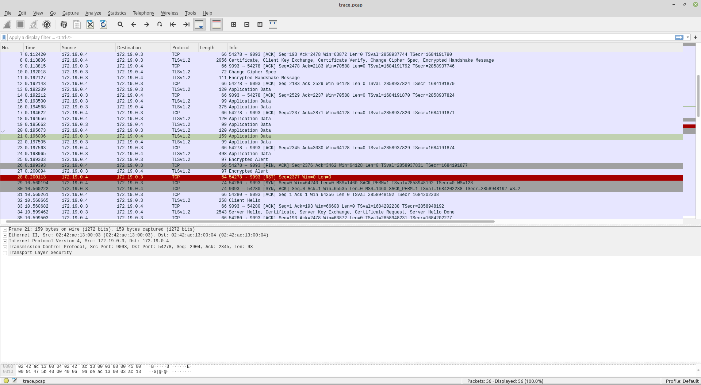
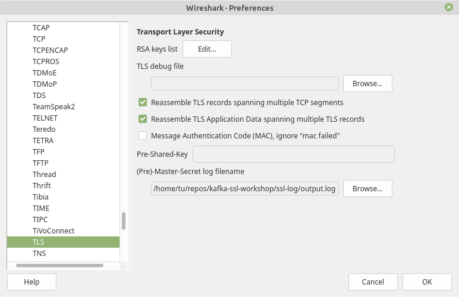
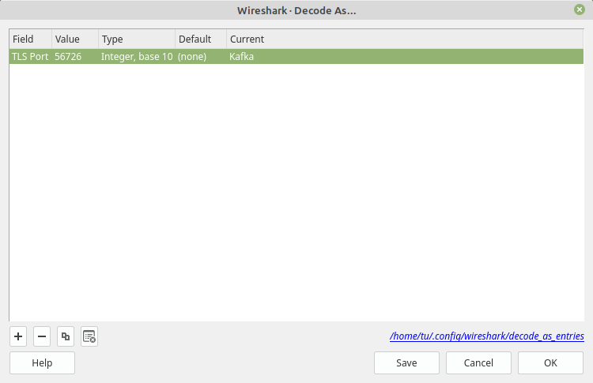
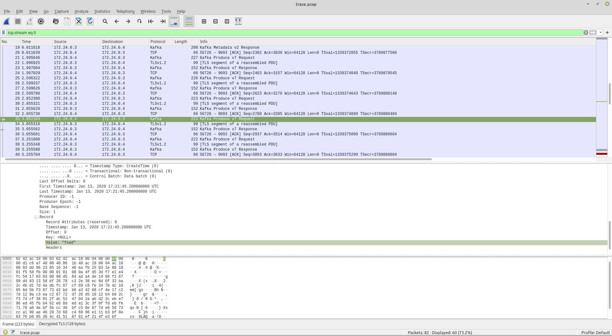

# Decrypt TLS traffic to Kafka using Wireshark

Usually, debugging issues related to TLS in a Java application involves setting the [debug flag](https://docs.oracle.com/javase/8/docs/technotes/guides/security/jsse/ReadDebug.html) `-Djavax.net.debug=ALL`. Unfortunately, the STDOUT will then be flooded with debug entries, which makes troubleshooting the TLS communication difficult.

Sometimes the problem can be solved just by decrypting the TLS traffic. One way to achieve this is to use [jSSLKeyLog](http://jsslkeylog.sourceforge.net/), which is a Java Agent Library to log TLS session keys to a file that can be loaded into the [Wireshark](https://www.wireshark.org/) network protocol analyzer.

Coupled with the recently improved [Kafka Protocol support](https://www.wireshark.org/docs/dfref/k/kafka.html) in Wireshark, this makes decrypting TLS traffic to/from Kafka captured using the [tcpdump](https://www.tcpdump.org/) packet sniffer easy.

## Procedure

Instrument the Kafka Broker and/or Kafka Client with the [jSSLKeyLog](http://jsslkeylog.sourceforge.net/) agent by adding the JVM flag

```text
-javaagent:/path/to/jSSLKeyLog.jar==/path/to/ssl-key.log
```

when starting the respective process. The Kafka Broker can be instrumented by appending the flag to the `KAFKA_OPTS` Environment Variable.

Then, use the [tcpdump](https://www.tcpdump.org/) packet sniffer to capture the traffic to/from the Kafka Broker SSL listener, for example by running

```bash
sudo tcpdump -i eth0 -N -A 'port 9093' -w /path/to/trace.pcap
```

on the Kafka Broker (adjust the interface, port or path to the packet capture file accordingly).

Finally, open the `trace.pcap` file in Wireshark. Without configuring the session key log, the TLS payload will be displayed as "Application Data".



Next, configure the location of the session key log generated by [jSSLKeyLog](http://jsslkeylog.sourceforge.net/) in Wireshark: **Edit > Preferences > Protocols > TLS > (Pre)-Master-Secret log filename**.



This allows us to see the decrypted TLS payload. To also take advantage of the Kafka Decoder in Wireshark: **Analyze > Decode As > Kafka**.



As a result, Wireshark will display the decoded Kafka API Request/Response pairs.



## Demo

The accompanying play-book provides a quick way to test the procedure described above using Docker Compose.

### Requirements

The demo uses versions of Wireshark and kafkacat not (yet) available in the standard package repositories.

- the attached _Makefile_ will build several Docker containers with the needed versions by downloading the source code and compiling the required binaries.
- the [jSSLKeyLog](http://jsslkeylog.sourceforge.net/) Agent will also be built from source and the artifact saved in the _tools_ directory. The directory will then be mounted inside the Docker containers running the Kafka Broker(s) and the agent attached via
  
  ```text
  KAFKA_OPTS: "-javaagent:/tmp/tools/jSSLKeyLog.jar==/tmp/ssl-key-log/output.log"
  ```

To build all the required components, simply run

```bash
make build-all
```

Important: building the required Docker containers requires some time as Wireshark is a complex application.

### Running the demo

- clone this repository

- bootstrap the environment

  ```bash
  make build-all
  ```

- create a local CA, Server and Client certificates
  
  ```bash
  make certs
  ```

- launch the Docker Compose stack

  ```bash
  docker-compose up -d
  ```

- start a Docker container running tcpdump and attach to the container running the Kafka Broker, see also [Using tcpdump with docker](https://rmoff.net/2019/11/29/using-tcpdump-with-docker/)

  ```bash
  docker run \
    --tty \
    --net=container:kafka-1 \
    -v ${PWD}/work/tcpdump-trace:/tmp/tcpdump-trace \
    docker-tcpdump:latest \
    tcpdump -N -A 'port 9093' -w /tmp/tcpdump-trace/trace.pcap
  ```

- run the kafkacat Docker container and produce some messages

  ```bash
  docker-compose exec kafkacat bash
  kafkacat -b kafka-1:9093 -L -F /tmp/certs/kafkacat.conf
  kafkacat -b kafka-1:9093 -t new_topic -P -F /tmp/certs/kafkacat.conf
  ```

- stop the packet capture using tcpdump

- open the packet capture using Wireshark. For convenience, the Docker stack provides a containerized Wireshark which is made available in the browser using [Xpra](https://xpra.org/).
  Access the Wireshark via the browser at

  [https://localhost:14500/?username=wireshark&password=wireshark](https://localhost:14500/?username=wireshark&password=wireshark)

- configure Wireshark to decode the Kafka TLS traffic as detailed [here](#procedure). The session key log and the packet capture are saved in the `${PWD}\work\ssl-key-log` and `${PWD}\work\tcpdump-trace` respectively. The directories are mounted in read-only mode inside the Wireshark container under the `/home/wireshark/work` path.

- stop and destroy the stack when finished

  ```bash
  docker-compose down -v
  ```

## References

- [Kafka protocol guide](https://kafka.apache.org/protocol)
- [Kafka 2.3+ dissesction support in Wireshark](https://code.wireshark.org/review/#/c/34224/)
- [Bugzilla ticket with sample captures](https://bugs.wireshark.org/bugzilla/show_bug.cgi?id=15988)
- [Practical Packet Analysis, 3rd Edition](https://nostarch.com/packetanalysis3)
- [Using tcpdump with Docker](https://rmoff.net/2019/11/29/using-tcpdump-with-docker/)
- [Wireshark Web Container Image](https://github.com/ffeldhaus/docker-wireshark)
